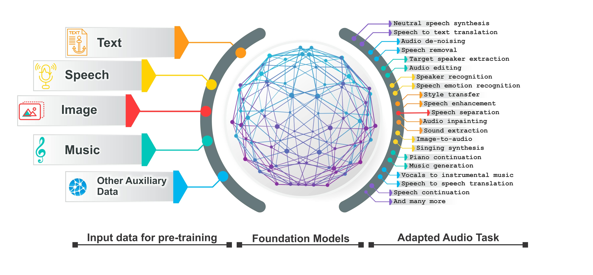

# 
 This repo supplements our survey [Sparks of Large Audio Models: A Survey and Outlook].

Authors: [Siddique Latif](https://scholar.google.com/citations?user=Scq5ADcAAAAJ&hl=en), [Moazzam Shoukat](https://scholar.google.com/citations?user=uU550yYAAAAJ&hl=en), [Fahad Shamshad](https://scholar.google.com.pk/citations?user=d7QL4wkAAAAJ&hl=en), [Muhammad Usama](https://scholar.google.com/citations?user=unGWVYMAAAAJ&hl=en), [Heriberto Cuayahuitl](https://scholar.google.com/citations?user=zDlQNDgAAAAJ&hl=en), [Bjorn  Schuller](https://scholar.google.com/citations?user=TxKNCSoAAAAJ&hl=en).

# 
`Awesome Large Language Models in Audio Signal Processing`

A curated list of awesome large language models in audio signal processing (**in chronological order**), inspired by the other awesome-initiatives. We intend to regularly update the relevant latest papers and their open-source implementations on this page. 

We strongly encourage the researchers that want to promote their fantastic work to the community to make pull request to update their paper's information!

## Overview
- [Survey papers](#survey)
- [Popular Large Audio Models](#Popular Large Audio Models)

- #survey
