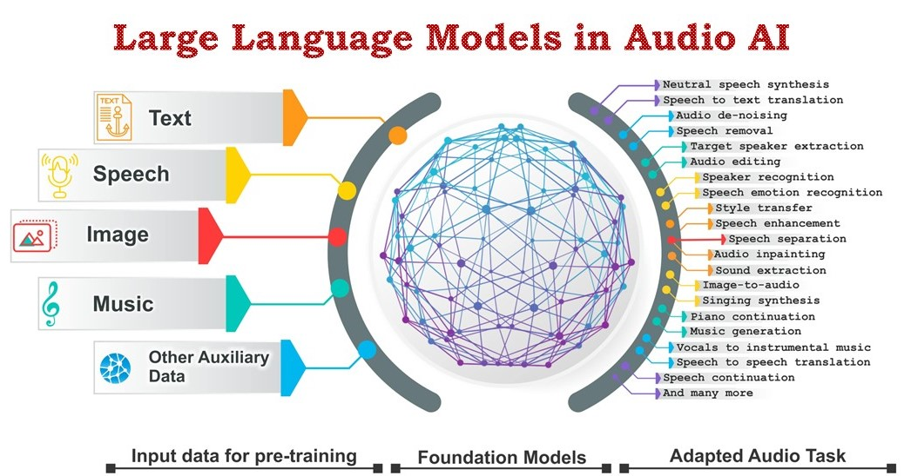
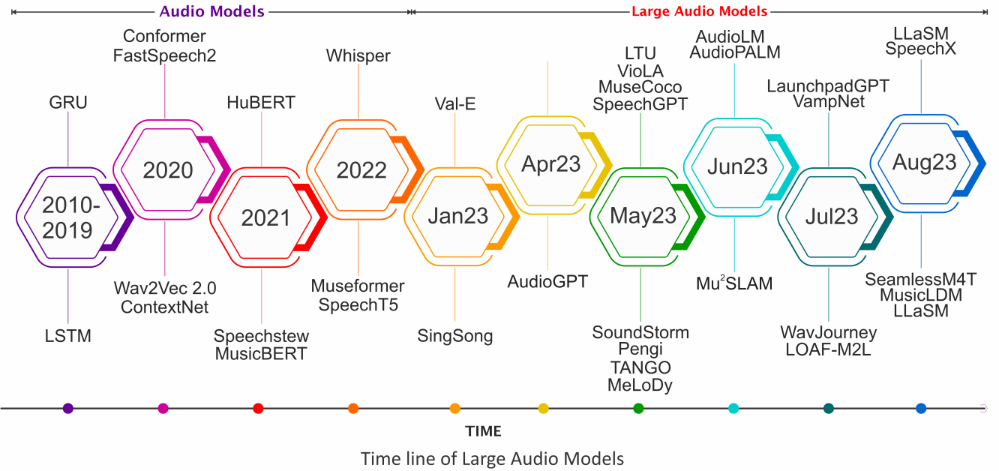
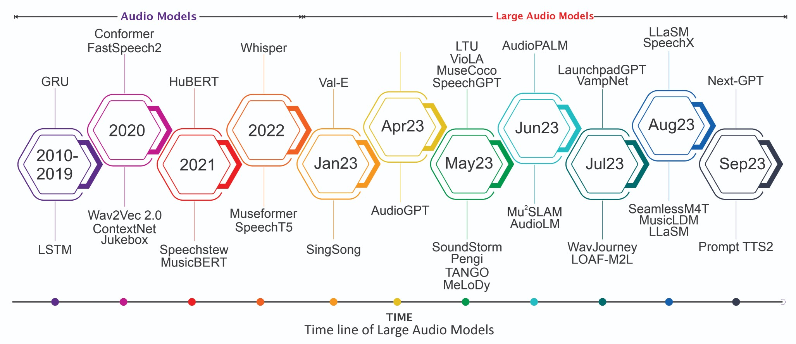

[](https://GitHub.com/Naereen/StrapDown.js/graphs/commit-activity)
[](http://makeapullrequest.com)
[](https://github.com/sindresorhus/awesome)



# <p align=center> This repo supplements our survey paper: [Sparks of Large Audio Models: A Survey and Outlook](https://arxiv.org/abs/2308.12792).

Authors: [Siddique Latif](https://scholar.google.com/citations?user=Scq5ADcAAAAJ), [Moazzam Shoukat](https://scholar.google.com/citations?user=uU550yYAAAAJ&hl=en), [Fahad Shamshad](https://scholar.google.com.pk/citations?user=d7QL4wkAAAAJ&hl=en), [Muhammad Usama](https://scholar.google.com/citations?user=unGWVYMAAAAJ&hl=en), [Yi Ren](https://scholar.google.com/citations?user=4FA6C0AAAAAJ&hl=zh-CN), [Heriberto Cuayahuitl](https://scholar.google.com/citations?user=zDlQNDgAAAAJ&hl=en), [Xulong Zhang](https://scholar.google.com/citations?hl=en&user=1XKLPoAAAAAJ), [Roberto Togneri](https://scholar.google.com.au/citations?user=uPELUScAAAAJ&hl=en), [Wenwu Wang](https://scholar.google.co.uk/citations?user=JQFnV5IAAAAJ&hl=en), [Bjorn  Schuller](https://scholar.google.com/citations?user=TxKNCSoAAAAJ&hl=en).
</p>

> **<p align="justify"> Abstract:** *This survey paper provides a comprehensive overview of the recent advancements and challenges in applying large language models to the field of audio signal processing. Audio processing, with its diverse signal representations and a wide range of sources--from human voices to musical instruments and environmental sounds--poses challenges distinct from those found in traditional Natural Language Processing scenarios. Nevertheless, Large Audio Models, epitomized by transformer-based architectures, have shown marked efficacy in this sphere. By leveraging massive amounts of data, these models have demonstrated prowess in a variety of audio tasks, spanning from Automatic Speech Recognition and Text-To-Speech to Music Generation, among others. Notably, recently these Foundational Audio Models, like SeamlessM4T, have started showing abilities to act as universal translators, supporting multiple speech tasks for up to 100 languages without any reliance on separate task-specific systems. This paper presents an in-depth analysis of state-of-the-art methodologies regarding Foundational Large Audio Models, their performance benchmarks, and their applicability to real-world scenarios. We also highlight current limitations and provide insights into potential future research directions in the realm of Large Audio Models with the intent to spark further discussion, thereby fostering innovation in the next generation of audio-processing systems.* </p>



<hr />

# <p align=center>` Awesome Large Language Models in Audio AI`</p>



A curated list of awesome large AI models in audio signal processing, inspired by the other awesome initiatives. We intend to regularly update the relevant latest papers and their open-source implementations on this page.

## Overview
- [Popular Large Audio Models](#popular-large-audio-models)
- [Automatic Speech Recognition (ASR)](#automatic-speech-recognition-asr)
- [Neural Speech Synthesis](#neural-speech-synthesis)
- [Speech Translation (ST)](#speech-translation-st)
- [Other Speech Applications](#other-speech-applications)
- [Large Audio Models in Music](#large-audio-models-in-music)
- [Audio Datasets](#audio-datasets)

# Survey Papers

**A review of deep learning techniques for speech processing** [2023].<br>*Ambuj Mehrish, Navonil Majumder, Rishabh Bharadwaj, Rada Mihalcea, Soujanya Poria*<br>[[PDF](https://www.sciencedirect.com/science/article/abs/pii/S1566253523001859)]<br>
**A survey on deep reinforcement learning for audio-based applications** [2023].<br>*Latif, Siddique and Cuay{\'a}huitl, Heriberto and Pervez, Farrukh and Shamshad, Fahad and Ali, Hafiz Shehbaz and Cambria, Erik*<br>[[PDF](https://link.springer.com/article/10.1007/s10462-022-10224-2)]<br>
**A Survey of Large Language Models** [2023].<br>*Wayne Xin Zhao, Kun Zhou, Junyi Li, Tianyi Tang, Xiaolei Wang, Yupeng Hou, Yingqian Min, Beichen Zhang, Junjie Zhang, Zican Dong, Yifan Du, Chen Yang, Yushuo Chen, Zhipeng Chen, Jinhao Jiang, Ruiyang Ren, Yifan Li, Xinyu Tang, Zikang Liu, Peiyu Liu, Jian-Yun Nie, Ji-Rong Wen*<br>[[PDF](https://arxiv.org/abs/2303.18223)]<br>
** survey on evaluation of large language models** [2023].<br>*Yupeng Chang, Xu Wang, Jindong Wang, Yuan Wu, Linyi Yang, Kaijie Zhu, Hao Chen, Xiaoyuan Yi, Cunxiang Wang, Yidong Wang, Wei Ye, Yue Zhang, Yi Chang, Philip S. Yu, Qiang Yang, Xing Xie*<br>[[PDF](https://arxiv.org/abs/2307.03109)]<br>
**Challenges and Applications of Large Language Models** [2023].<br>*Kaddour, Jean and Harris, Joshua and Mozes, Maximilian and Bradley, Herbie and Raileanu, Roberta and McHardy, Robert*<br>[[PDF](https://arxiv.org/abs/2307.10169)]<br>
**Aligning Large Language Models with Human: A Survey** [2023].<br>*Yufei Wang, Wanjun Zhong, Liangyou Li, Fei Mi, Xingshan Zeng, Wenyong Huang, Lifeng Shang, Xin Jiang, Qun Liu*<br>[[PDF](https://arxiv.org/abs/2307.12966)]<br>
**A Comprehensive Survey on Segment Anything Model for Vision and Beyond** [2023].<br>*Zhang, Chunhui and Liu, Li and Cui, Yawen and Huang, Guanjie and Lin, Weilin and Yang, Yiqian and Hu, Yuehong*<br>[[PDF](https://arxiv.org/abs/2305.08196)]<br>
**Vision-language models for vision tasks: A survey** [2023].<br>*Zhang, Jingyi and Huang, Jiaxing and Jin, Sheng and Lu, Shijian*<br>[[PDF](https://arxiv.org/abs/2304.00685)]<br>
**Foundational Models Defining a New Era in Vision: A Survey and Outlook** [2023].<br>*Awais, Muhammad and Naseer, Muzammal and Khan, Salman and Anwer, Rao Muhammad and Cholakkal, Hisham and Shah, Mubarak and Yang, Ming-Hsuan and Khan, Fahad Shahbaz*<br>[[PDF](https://arxiv.org/abs/2307.13721)]<br>
**Performance of ChatGPT on USMLE: Potential for AI-assisted medical education using large language models** [2023].<br>*Tiffany H. Kung, Morgan Cheatham, Arielle Medenilla, Czarina Sillos, Lorie De Leon, Camille Elepaño, Maria Madriaga, Rimel Aggabao, Giezel Diaz-Candido, James Maningo, Victor Tseng*<br>[[PDF](https://journals.plos.org/digitalhealth/article?id=10.1371/journal.pdig.0000198)]<br>
**Engineering education in the era of ChatGPT: Promise and pitfalls of generative AI for education** [2023].<br>*Junaid Qadir*<br>[[PDF](https://ieeexplore.ieee.org/abstract/document/10125121)]<br>
**ChatGPT: Bullshit spewer or the end of traditional assessments in higher education?** [2023].<br>*Jürgen Rudolph, Samson Tan, Shannon Tan*<br>[[PDF](https://journals.sfu.ca/jalt/index.php/jalt/article/download/689/539/3059)]<br>
**Foundation models for generalist medical artificial intelligence** [2023].<br>*Moor, Michael and Banerjee, Oishi and Abad, Zahra Shakeri Hossein and Krumholz, Harlan M and Leskovec, Jure and Topol, Eric J and Rajpurkar, Pranav*<br>[[PDF](https://www.nature.com/articles/s41586-023-05881-4)]<br>
**Large AI models in health informatics: Applications, challenges, and the future** [2023].<br>*Jianing Qiu, Lin Li, Jiankai Sun, Jiachuan Peng, Peilun Shi, Ruiyang Zhang, Yinzhao Dong, Kyle Lam, Frank P.-W. Lo, Bo Xiao, Wu Yuan, Dong Xu, Benny Lo*<br>[[PDF](https://arxiv.org/abs/2303.11568)]<br>
**The shaky foundations of large language models and foundation models for electronic health records** [2023].<br>*Michael Wornow, Yizhe Xu, Rahul Thapa, Birju Patel, Ethan Steinberg, Scott Fleming, Michael A. Pfeffer, Jason Fries & Nigam H. Shah*<br>[[PDF](https://www.nature.com/articles/s41746-023-00879-8)]<br>
**On the Challenges and Perspectives of Foundation Models for Medical Image Analysis** [2023].<br>*Shaoting Zhang, Dimitris Metaxas*<br>[[PDF](https://arxiv.org/abs/2306.05705)]<br>
**Survey of Protein Sequence Embedding Models** [2023].<br>*Chau Tran, Siddharth Khadkikar, Aleksey Porollo*<br>[[PDF](https://www.mdpi.com/1422-0067/24/4/3775)]<br>
**A Short Survey of Viewing Large Language Models in Legal Aspect** [2023].<br>*Zhongxiang Sun*<br>[[PDF](https://arxiv.org/abs/2303.09136)]<br>
**Large Language Models as Tax Attorneys: A Case Study in Legal Capabilities Emergence** [2023].<br>*John J. Nay, David Karamardian, Sarah B. Lawsky, Wenting Tao, Meghana Bhat, Raghav Jain, Aaron Travis Lee, Jonathan H. Choi, Jungo Kasai*<br>[[PDF](https://arxiv.org/abs/2306.07075)]<br>
**Foundation Models for Decision Making: Problems, Methods, and Opportunities** [2023].<br>*Sherry Yang, Ofir Nachum, Yilun Du, Jason Wei, Pieter Abbeel, Dale Schuurmans*<br>[[PDF](https://arxiv.org/abs/2303.04129)]<br>
**Transformers in speech processing: A survey** [2022].<br>*Siddique Latif, Aun Zaidi, Heriberto Cuayahuitl, Fahad Shamshad, Moazzam Shoukat, Junaid Qadir*<br>[[PDF](https://arxiv.org/abs/2303.11607)]<br>
**On the opportunities and risks of foundation models** [2022].<br>*Rishi Bommasani, Drew A. Hudson, Ehsan Adeli, Russ Altman, Simran Arora, Sydney von Arx et. al. *<br>[[PDF](https://arxiv.org/abs/2108.07258)]<br>
**Vision-language pre-training: Basics, recent advances, and future trends** [2022].<br>*Zhe Gan, Linjie Li, Chunyuan Li, Lijuan Wang, Zicheng Liu, Jianfeng Gao*<br>[[PDF](https://www.nowpublishers.com/article/Details/CGV-105)]<br>
**ChatGPT for good? On opportunities and challenges of large language models for education** [2022].<br>*Enkelejda Kasneci, Kathrin Sessler, Stefan Küchemann, Maria Bannert, Daryna Dementieva, Frank Fischer, Urs Gasser, Georg Groh, Stephan Günnemann, Eyke Hüllermeier, Stephan Krusche, Gitta Kutyniok, Tilman Michaeli, Claudia Nerdel, Jürgen Pfeffer, Oleksandra Poquet, Michael Sailer, Albrecht Schmidt, Tina Seidel, Matthias Stadler, Jochen Weller, Jochen Kuhn, Gjergji Kasneci*<br>[[PDF](https://www.sciencedirect.com/science/article/pii/S1041608023000195)]<br>
**Protein language models and structure prediction: Connection and progression** [2022].<br>*Bozhen Hu, Jun Xia, Jiangbin Zheng, Cheng Tan, Yufei Huang, Yongjie Xu, Stan Z. Li*<br>[[PDF](https://arxiv.org/abs/2211.16742)]<br>
**A human being wrote this law review article: GPT-3 and the practice of law** [2022].<br>*Amy B. Cyphert*<br>[[PDF](https://researchrepository.wvu.edu/cgi/viewcontent.cgi?article=1099&context=law_faculty)]<br>
**A comparative study on transformer vs rnn in speech applications** [2019].<br>*Shigeki Karita, Nanxin Chen, Tomoki Hayashi, Takaaki Hori, Hirofumi Inaguma, Ziyan Jiang, Masao Someki, Nelson Enrique Yalta Soplin, Ryuichi Yamamoto, Xiaofei Wang, Shinji Watanabe, Takenori Yoshimura, Wangyou Zhang*<br>[[PDF](https://ieeexplore.ieee.org/abstract/document/9003750)]<br>


## Popular Large Audio Models
**Speechgpt: Empowering large language models with intrinsic cross-modal conversational abilities.** [2023].<br> *Zhang, Dong, Shimin Li, Xin Zhang, Jun Zhan, Pengyu Wang, Yaqian Zhou, and Xipeng Qiu.*<br>[[PDF](https://arxiv.org/pdf/2305.11000.pdf)]<br>
**AudioPaLM: A Large Language Model That Can Speak and Listen.** [2023].<br> *Rubenstein, Paul K., Chulayuth Asawaroengchai, Duc Dung Nguyen, Ankur Bapna, Zalán Borsos, Félix de Chaumont Quitry, Peter Chen et al.*<br>[[PDF](https://arxiv.org/abs/2306.12925)]<br>
**AudioLM: A Language Modeling Approach to Audio Generation** [2023].<br>*Zalán Borsos, Raphaël Marinier, Damien Vincent, Eugene Kharitonov, Olivier Pietquin, Matt Sharifi, Dominik Roblek, Olivier Teboul, David Grangier, Marco Tagliasacchi, Neil Zeghidour*<br>[[PDF](https://ieeexplore.ieee.org/abstract/document/10158503)]<br>
**Listen, Think, and Understand** [2023].<br>*Yuan Gong, Hongyin Luo, Alexander H. Liu, Leonid Karlinsky, James Glass*<br>[[PDF](https://arxiv.org/abs/2305.10790)]<br>
**VioLA: Unified Codec Language Models for Speech Recognition, Synthesis, and Translation** [2023].<br>*Tianrui Wang, Long Zhou, Ziqiang Zhang, Yu Wu, Shujie Liu, Yashesh Gaur, Zhuo Chen, Jinyu Li, Furu Wei*<br>[[PDF](https://arxiv.org/abs/2305.16107)]<br>
**Audiogen: Textually guided audio generation** [2022].<br>*Felix Kreuk, Gabriel Synnaeve, Adam Polyak, Uriel Singer, Alexandre Défossez, Jade Copet, Devi Parikh, Yaniv Taigman, Yossi Adi*<br>[[PDF](https://arxiv.org/abs/2209.15352)]<br>
**Simple and Controllable Music Generation** [2023].<br>*Jade Copet, Felix Kreuk, Itai Gat, Tal Remez, David Kant, Gabriel Synnaeve, Yossi Adi, Alexandre Défossez*<br>[[PDF](https://arxiv.org/abs/2306.05284)]<br>
**MusicLM: Generating Music From Text** [2023].<br>*Andrea Agostinelli, Timo I. Denk, Zalán Borsos, Jesse Engel, Mauro Verzetti, Antoine Caillon, Qingqing Huang, Aren Jansen, Adam Roberts, Marco Tagliasacchi, Matt Sharifi, Neil Zeghidour, Christian Frank*<br>[[PDF](https://arxiv.org/abs/2301.11325)]<br>
**SeamlessM4T—Massively Multilingual & Multimodal Machine Translation** [2023].<br>*Seamless Communication, Loic Barrault, Andy Chung, David Dale, Ning Dong (AI), Paul-Ambroise Duquenne, Hady Elsahar et. al.*<br>[[PDF](https://ai.meta.com/research/publications/seamless-m4t/)]<br>
**SALMONN: Towards Generic Hearing Abilities for Large Language Models** [2023].<br>*Changli Tang, Wenyi Yu, Guangzhi Sun, Xiaozhao Chen, Tian Tan, Wei Li, Lu Lu, Zejun Ma, Chao Zhang*<br>[[PDF](https://arxiv.org/abs/2310.13289)][[Github](https://github.com/bytedance/SALMONN)]<br>
<br>

## Automatic Speech Recognition (ASR)

**On decoder-only architecture for speech-to-text and large language model integration** [2023].<br>*Jian Wu, Yashesh Gaur, Zhuo Chen, Long Zhou, Yimeng Zhu, Tianrui Wang, Jinyu Li, Shujie Liu, Bo Ren, Linquan Liu, Yu Wu*<br>[[PDF](https://arxiv.org/abs/2307.03917)]<br>
**X-LLM: Bootstrapping Advanced Large Language Models by Treating Multi-Modalities as Foreign Languages** [2023].<br>*Feilong Chen, Minglun Han, Haozhi Zhao, Qingyang Zhang, Jing Shi, Shuang Xu, Bo Xu*<br>[[PDF](https://arxiv.org/abs/2305.04160)][[Github](https://github.com/phellonchen/X-LLM)]<br>
**Adapting Large Language Model with Speech for Fully Formatted End-to-End Speech Recognition** [2023].<br>*Shaoshi Ling, Yuxuan Hu, Shuangbei Qian, Guoli Ye, Yao Qian, Yifan Gong, Ed Lin, Michael Zeng*<br>[[PDF](https://arxiv.org/abs/2307.08234)]<br>
**Semantic Segmentation with Bidirectional Language Models Improves Long-form ASR** [2023].<br>*W. Ronny Huang, Hao Zhang, Shankar Kumar, Shuo-yiin Chang, Tara N. Sainath*<br>[[PDF](https://arxiv.org/abs/2305.18419)]<br>
**Prompting Large Language Models with Speech Recognition Abilities** [2023].<br>*Yassir Fathullah, Chunyang Wu, Egor Lakomkin, Junteng Jia, Yuan Shangguan, Ke Li, Jinxi Guo, Wenhan Xiong, Jay Mahadeokar, Ozlem Kalinli, Christian Fuegen, Mike Seltzer*<br>[[PDF](https://arxiv.org/abs/2307.11795)]<br>
**Connecting Speech Encoder and Large Language Model for ASR** [2023].<br>*Wenyi Yu, Changli Tang, Guangzhi Sun, Xiaozhao Chen, Tian Tan, Wei Li, Lu Lu, Zejun Ma, Chao Zhang*<br>[[PDF](https://arxiv.org/abs/2309.13963)]<br>
**SALMONN: Towards Generic Hearing Abilities for Large Language Models** [2023].<br>*Changli Tang, Wenyi Yu, Guangzhi Sun, Xiaozhao Chen, Tian Tan, Wei Li, Lu Lu, Zejun Ma, Chao Zhang*<br>[[PDF](https://arxiv.org/abs/2310.13289)][[Github](https://github.com/bytedance/SALMONN)]<br>
<br>
## Neural Speech Synthesis

**Investigating the Utility of Surprisal from Large Language Models for Speech Synthesis Prosody** [2023].<br>*Sofoklis Kakouros, Juraj Šimko, Martti Vainio, Antti Suni*<br>[[PDF](https://arxiv.org/abs/2306.09814)]<br>
**Neural Codec Language Models are Zero-Shot Text to Speech Synthesizers** [2023].<br>*Chengyi Wang, Sanyuan Chen, Yu Wu, Ziqiang Zhang, Long Zhou, Shujie Liu, Zhuo Chen, Yanqing Liu, Huaming Wang, Jinyu Li, Lei He, Sheng Zhao, Furu Wei*<br>[[PDF](https://arxiv.org/abs/2301.02111)]<br>
**Speak, read and prompt: High-fidelity text-to-speech with minimal supervision** [2023].<br>*Eugene Kharitonov, Damien Vincent, Zalán Borsos, Raphaël Marinier, Sertan Girgin, Olivier Pietquin, Matt Sharifi, Marco Tagliasacchi, Neil Zeghidour*<br>[[PDF](https://arxiv.org/abs/2302.03540)]<br>
**Speechlmscore: Evaluating Speech Generation Using Speech Language Model** [2023].<br>*Soumi Maiti, Yifan Peng, Takaaki Saeki, Shinji Watanabe*<br>[[PDF](https://ieeexplore.ieee.org/abstract/document/10095710)]<br>
**LM-VC: Zero-shot Voice Conversion via Speech Generation based on Language Models** [2023].<br>*Zhichao Wang, Yuanzhe Chen, Lei Xie, Qiao Tian, Yuping Wang*<br>[[PDF](https://arxiv.org/abs/2306.10521)]<br>
**Assessing Phrase Break of ESL Speech with Pre-trained Language Models and Large Language Models** [2023].<br>*Zhiyi Wang, Shaoguang Mao, Wenshan Wu, Yan Xia, Yan Deng, Jonathan Tien*<br>[[PDF](https://arxiv.org/abs/2306.04980)]<br>
<br>

## Speech Translation (ST)

**SeamlessM4T—Massively Multilingual & Multimodal Machine Translation** [2023].<br>*Seamless Communication, Loic Barrault, Andy Chung, David Dale, Ning Dong (AI), Paul-Ambroise Duquenne, Hady Elsahar, Hongyu Gong, Kevin Heffernan, John Hoffman, Christopher Klaiber, Peng-Jen Chen, Daniel Licht, Jean Maillard, Alice Rakotoarison, Kaushik Ram Sadagopan, Guillaume Wenzek, Abinesh Ramakrishnan, Alexandre Mourachko, Amanda Kallet, Ann Lee, Anna Sun, Bapi Akula, Benjamin Peloquin, Bernie Huang, Bokai Yu, Brian Ellis, Can Balioglu, Carleigh Wood, Changhan Wang, Christophe Ropers, Cynthia Gao, Daniel Li (FAIR), Elahe Kalbassi, Ethan Ye, Gabriel Mejia Gonzalez, Hirofumi Inaguma, Holger Schwenk, Igor Tufanov, Ilia Kulikov, Janice Lam, Jeff Wang (PM - AI), Juan Pino, Justin Haaheim, Justine Kao, Prangthip Hasanti, Kevin Tran, Maha Elbayad, Marta R. Costa-jussa, Mohamed Ramadan, Naji El Hachem, Onur Çelebi, Paco Guzmán, Paden Tomasello, Pengwei Li, Pierre Andrews, Ruslan Mavlyutov, Russ Howes, Safiyyah Saleem, Skyler Wang, Somya Jain, Sravya Popuri, Tuan Tran, Vish Vogeti, Xutai Ma, Yilin Yang*<br>[[PDF](https://ai.meta.com/research/publications/seamless-m4t/)]<br>
**PolyVoice: Language Models for Speech to Speech Translation** [2023].<br>*Qianqian Dong, Zhiying Huang, Qiao Tian, Chen Xu, Tom Ko, Yunlong Zhao, Siyuan Feng, Tang Li, Kexin Wang, Xuxin Cheng, Fengpeng Yue, Ye Bai, Xi Chen, Lu Lu, Zejun Ma, Yuping Wang, Mingxuan Wang, Yuxuan Wang*<br>[[PDF](https://arxiv.org/abs/2306.02982)]<br>
**AudioPaLM: A Large Language Model That Can Speak and Listen** [2023].<br>*Paul K. Rubenstein, Chulayuth Asawaroengchai, Duc Dung Nguyen, Ankur Bapna, Zalán Borsos, Félix de Chaumont Quitry, Peter Chen, Dalia El Badawy, Wei Han, Eugene Kharitonov, Hannah Muckenhirn, Dirk Padfield, James Qin, Danny Rozenberg, Tara Sainath, Johan Schalkwyk, Matt Sharifi, Michelle Tadmor Ramanovich, Marco Tagliasacchi, Alexandru Tudor, Mihajlo Velimirović, Damien Vincent, Jiahui Yu, Yongqiang Wang, Vicky Zayats, Neil Zeghidour, Yu Zhang, Zhishuai Zhang, Lukas Zilka, Christian Frank*<br>[[PDF](https://arxiv.org/abs/2306.12925)]<br>
**SALMONN: Towards Generic Hearing Abilities for Large Language Models** [2023].<br>*Changli Tang, Wenyi Yu, Guangzhi Sun, Xiaozhao Chen, Tian Tan, Wei Li, Lu Lu, Zejun Ma, Chao Zhang*<br>[[PDF](https://arxiv.org/abs/2310.13289)][[Github](https://github.com/bytedance/SALMONN)]<br>
<br>

## Other Speech Applications

**SpeechX: Neural Codec Language Model as a Versatile Speech Transformer** [2023].<br>*Xiaofei Wang, Manthan Thakker, Zhuo Chen, Naoyuki Kanda, Sefik Emre Eskimez, Sanyuan Chen, Min Tang, Shujie Liu, Jinyu Li, Takuya Yoshioka*<br>[[PDF](https://arxiv.org/abs/2308.06873)]<br>
**Audiogpt: Understanding and generating speech, music, sound, and talking head** [2023].<br>*Rongjie Huang, Mingze Li, Dongchao Yang, Jiatong Shi, Xuankai Chang, Zhenhui Ye, Yuning Wu, Zhiqing Hong, Jiawei Huang, Jinglin Liu, Yi Ren, Zhou Zhao, Shinji Watanabe*<br>[[PDF](https://arxiv.org/abs/2304.12995)]<br>
**X-LLM: Bootstrapping Advanced Large Language Models by Treating Multi-Modalities as Foreign Languages** [2023].<br>*Feilong Chen, Minglun Han, Haozhi Zhao, Qingyang Zhang, Jing Shi, Shuang Xu, Bo Xu*<br>[[PDF](https://arxiv.org/abs/2305.04160)][[Github](https://github.com/phellonchen/X-LLM)]<br>
**Can Large Language Models Aid in Annotating Speech Emotional Data? Uncovering New Frontiers** [2023].<br>*Siddique Latif, Muhammad Usama, Mohammad Ibrahim Malik, Björn W. Schuller*<br>[[PDF](https://arxiv.org/abs/2307.06090)]<br>
**LLaSM: Large Language and Speech Model** [2023].<br>*Yu Shu, Siwei Dong, Guangyao Chen, Wenhao Huang, Ruihua Zhang, Daochen Shi, Qiqi Xiang, Yemin Shi*<br>[[PDF](https://arxiv.org/abs/2308.15930)]<br>
**SALMONN: Towards Generic Hearing Abilities for Large Language Models** [2023].<br>*Changli Tang, Wenyi Yu, Guangzhi Sun, Xiaozhao Chen, Tian Tan, Wei Li, Lu Lu, Zejun Ma, Chao Zhang*<br>[[PDF](https://arxiv.org/abs/2310.13289)][[Github](https://github.com/bytedance/SALMONN)]<br>
<br>

## Large Audio Models in Music

**MusicGen: Simple and Controllable Music Generation** [2023].<br>*Jade Copet, Felix Kreuk, Itai Gat, Tal Remez, David Kant, Gabriel Synnaeve, Yossi Adi, Alexandre Défossez*<br>[[PDF](https://arxiv.org/abs/2306.05284)]<br>
**JEN-1: Text-Guided Universal Music Generation with Omnidirectional Diffusion Models** [2023].<br>*Peike Li, Boyu Chen, Yao Yao, Yikai Wang, Allen Wang, Alex Wang*<br>[[PDF](https://arxiv.org/abs/2308.04729)]<br>
**VampNet: Music Generation via Masked Acoustic Token Modeling** [2023].<br>*Hugo Flores Garcia, Prem Seetharaman, Rithesh Kumar, Bryan Pardo*<br>[[PDF](https://arxiv.org/abs/2307.04686)]<br>
**Text-to-Audio Generation using Instruction-Tuned LLM and Latent Diffusion Model** [2023].<br>*Deepanway Ghosal, Navonil Majumder, Ambuj Mehrish, Soujanya Poria*<br>[[PDF](https://arxiv.org/abs/2304.13731)]<br>
**WavJourney: Compositional Audio Creation with Large Language Models** [2023].<br>*Xubo Liu, Zhongkai Zhu, Haohe Liu, Yi Yuan, Meng Cui, Qiushi Huang, Jinhua Liang, Yin Cao, Qiuqiang Kong, Mark D. Plumbley, Wenwu Wang*<br>[[PDF](https://arxiv.org/abs/2307.14335)]<br>
**MusicLDM: Enhancing Novelty in Text-to-Music Generation Using Beat-Synchronous Mixup Strategies** [2023].<br>*Ke Chen, Yusong Wu, Haohe Liu, Marianna Nezhurina, Taylor Berg-Kirkpatrick, Shlomo Dubnov*<br>[[PDF](https://arxiv.org/abs/2308.01546)]<br>
**Exploring the efficacy of pre-trained checkpoints in text-to-music generation task** [2022].<br>*Shangda Wu, Maosong Sun*<br>[[PDF](https://arxiv.org/abs/2211.11216)]<br>
**SingSong: Generating musical accompaniments from singing** [2023].<br>*Chris Donahue, Antoine Caillon, Adam Roberts, Ethan Manilow, Philippe Esling, Andrea Agostinelli, Mauro Verzetti, Ian Simon, Olivier Pietquin, Neil Zeghidour, Jesse Engel*<br>[[PDF](https://arxiv.org/abs/2301.12662)]<br>
**LOAF-M2L: Joint Learning of Wording and Formatting for Singable Melody-to-Lyric Generation** [2023].<br>*Longshen Ou, Xichu Ma, Ye Wang*<br>[[PDF](https://arxiv.org/abs/2307.02146)]<br>
**Efficient Neural Music Generation** [2023].<br>*Max W. Y. Lam, Qiao Tian, Tang Li, Zongyu Yin, Siyuan Feng, Ming Tu, Yuliang Ji, Rui Xia, Mingbo Ma, Xuchen Song, Jitong Chen, Yuping Wang, Yuxuan Wang*<br>[[PDF](https://arxiv.org/abs/2305.15719)]<br>
**MuseCoco: Generating Symbolic Music from Text** [2023].<br>*Peiling Lu, Xin Xu, Chenfei Kang, Botao Yu, Chengyi Xing, Xu Tan, Jiang Bian*<br>[[PDF](https://arxiv.org/abs/2306.00110)]<br>
**LaunchpadGPT: Language Model as Music Visualization Designer on Launchpad** [2023].<br>*Siting Xu, Yunlong Tang, Feng Zheng*<br>[[PDF](https://arxiv.org/abs/2307.04827)]<br>
**Music Understanding LLaMA: Advancing Text-to-Music Generation with Question Answering and Captioning** [2023].<br>*Shansong Liu, Atin Sakkeer Hussain, Chenshuo Sun, Ying Shan*<br>[[PDF](https://arxiv.org/abs/2308.11276)][[Github](https://github.com/crypto-code/MU-LLaMA)]<br>
**SALMONN: Towards Generic Hearing Abilities for Large Language Models** [2023].<br>*Changli Tang, Wenyi Yu, Guangzhi Sun, Xiaozhao Chen, Tian Tan, Wei Li, Lu Lu, Zejun Ma, Chao Zhang*<br>[[PDF](https://arxiv.org/abs/2310.13289)][[Github](https://github.com/bytedance/SALMONN)]<br>
**Mustango: Toward Controllable Text-to-Music Generation** [2023].<br>*Jan Melechovsky, Zixun Guo, Deepanway Ghosal, Navonil Majumder, Dorien Herremans, Soujanya Poria*<br>[[PDF](https://arxiv.org/pdf/2311.08355.pdf)][[Github](https://github.com/AMAAI-Lab/mustango)]<br>
<br>


## Audio Datasets
| Title | Full Name | Size | Link |
| -------- | -------- | -------- | -------- |
| CommonVoice 11 | CommonVoice: A Massively Multilingual Speech Corpus | 58250 Voices of 2508 hours | [Download](https://voice.mozilla.org/en/datasets) |
| Libri-Light | Libri-Light: A Benchmark for ASR with Limited or No Supervision | 60000 Hours | [Download](https://ai.facebook.com/tools/libri-light) |
| Wenetspeech | Wenetspeech: A 10000+ hours multi-domain mandarin corpus for speech recognition | 10000 Hours  | [Download](https://github.com/wenet-e2e/WenetSpeech) |
| Gigaspeech | Gigaspeech: An evolving, multi-domain asr corpus with 10,000 hours of transcribed audio | 50000 Hours | [Download](https://github.com/SpeechColab/GigaSpeech) |
| MuST-C | MuST-C: a Multilingual Speech Translation Corpus | 3600 Hours | [Download](https://aclanthology.org/N19-1202.pdf) |
| VoxPopuli | VoxPopuli: A Large-Scale Multilingual Speech Corpus for Representation Learning, Semi-Supervised Learning and Interpretation | 400k Hours | [Download](https://github.com/facebookresearch/voxpopuli) |
| CoVoST | CoVoST: A Large-Scale Multilingual Speech-To-Text Translation Corpus | 2280 Hours | [Download](https://github.com/facebookresearch/covost) |
| CVSS | CVSS: A Massively Multilingual Speech-to-Speech Translation Corpus | 3909 Hours | [Download](https://github.com/google-research-datasets/cvss) |
| EMIME | The EMIME bilingual database | - | [Download](https://www.emime.org/participate/emime-bilingual-database.html) |
| Audiocaps | Audiocaps: Generating captions for audios in the wild | 46000 Audios | [Download](https://github.com/cdjkim/audiocaps) |
| Clotho | Clotho: An audio captioning dataset | 4981 audios 24905 captions | [Download](https://zenodo.org/record/3490684) |
| Audio set | Audio set: An ontology and human-labeled dataset for audio events | 5.8k hours | [Download](g.co/audioset) |
| Emopia | Emopia: A multi-modal pop piano dataset for emotion recognition and emotion-based music generation | 387 piano solo sounds  | [Download](https://zenodo.org/record/5090631) |
| MetaMIDI | Building the MetaMIDI Dataset: Linking Symbolic and Audio Musical Data | 436631 MIDI files | [Download](#) |
| DALI2 | Creating DALI, a Large Dataset of Synchronized Audio, Lyrics, and Notes | 7756 Songs | [Download](https://github.com/gabolsgabs/DALI) |
| MillionMIDI |  Million MIDI Dataset (MMD) | 100k Songs | [Download](#) |
| Vggsound | Vggsound: A Large-Scale Audio-Visual Dataset | 200k Videos | [Download](https://www.robots.ox.ac.uk/~vgg/data/vggsound/) |
| FSD50K | FSD50K: An Open Dataset of Human-Labeled Sound Events | 51197 Sound Clips | [Download](https://zenodo.org/record/4060432) |
| Symphony | Symphony generation with permutation invariant language model | 46359 MIDI files | [Download](https://symphonynet.github.io/) |
| MusicCaps | MusicLM: Generating Music From Text | 5521 music-text pairs | [Download](https://www.kaggle.com/datasets/googleai/musiccaps) |
| Jamendo | The MTG-Jamendo dataset for automatic music tagging | 55525 Tracks | [Download](https://github.com/MTG/mtg-jamendo-dataset) |
| MusicBench | Mustango: Toward Controllable Text-to-Music Generation | 53168 Tracks | [Download](https://huggingface.co/datasets/amaai-lab/MusicBench) |


# Citation

If you find the listing and survey useful for your work, please cite the paper:

```
@article{latif2023sparks,
  title={Sparks of Large Audio Models: A Survey and Outlook},
  author={Latif, Siddique and Shoukat, Moazzam and Shamshad, Fahad and Usama, Muhammad and Cuay{\'a}huitl, Heriberto and Schuller, Bj{\"o}rn W},
  journal={arXiv preprint arXiv:2308.12792},
  year={2023}
}
```
